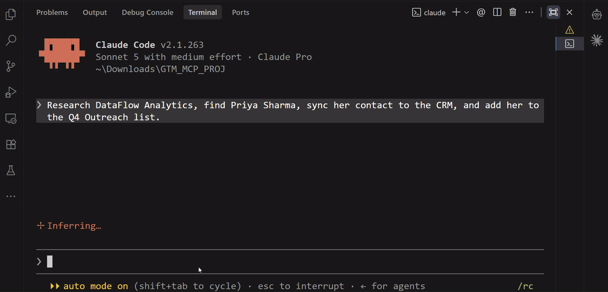

# GTM MCP Server

An [MCP](https://modelcontextprotocol.io) server that lets an AI agent research a company,
find the right contact, and safely sync that work into a CRM — with writes off by default, a
dry-run mode, and every attempt audited. MCP is the protocol Claude (and other AI clients) use
to call external tools, so this server plugs go-to-market work — enrichment, CRM lookup,
guarded CRM writes — directly into an agent's tool set instead of a human copying data between tabs.

## Demo

Live Claude Code session using the GTM MCP server:



Claude calling the GTM tools directly — enrichment, CRM lookup, a guarded write — over live
tool calls against offline/synthetic sample data, not a real company or CRM.

## MCP Tools

| Tool | Read/Write | Purpose | Safety behavior |
| --- | --- | --- | --- |
| `server_info` | read | Reports capabilities, configured provider, and current guardrail settings | — |
| `search_company` | read | Firmographic enrichment from a domain or name | One provider call per invocation; never retries a rejection or guesses a domain |
| `search_contact` | read | People enrichment from a name and company | Same cost discipline; resolves one named person, not a title |
| `crm_query` | read | Query the CRM with bounded, typed filters | No provider cost; emits no audit event (nothing mutated) |
| `sync_to_crm` | write | Upsert one contact into the CRM | Disabled by default (`rejected`); dry-run capable; never overwrites a populated field with `null`; audited every attempt |
| `save_to_list` | write | Add an existing contact to a named list | Same guardrails as above; adding twice reports `unchanged`, not a duplicate |

Write tools stay listed even when disabled — a refusal is audited, not hidden.

## Architecture

```
MCP client (Claude Desktop / Claude Code / Inspector)
              │  JSON-RPC over stdio
              ▼
tools/       schemas from types, annotations, no business logic
              ▼
services/    EnrichmentService, CrmService — guardrails live here
              ▼
ports.py     CompanyEnrichmentProvider, CrmRepository (no delete method)
              ▼
adapters/    providers/ (hunter live, sample) · crm/ (Postgres)
```

Dependencies point inward only; only the tool layer imports `mcp`. Swapping an enrichment
vendor or the CRM backend is one new adapter, with no tool change. Details in
[ARCHITECTURE.md](ARCHITECTURE.md) and [DECISIONS.md](DECISIONS.md).

## Guardrails

Enforced by tests, not just documented:

- **Writes disabled by default** — every mutation returns `rejected`, not silently skipped.
- **Dry-run mode** — full validation runs, then the write returns `dry_run` without persisting.
- **Bounded and idempotent** — one record per call by default; repeating a write reports `unchanged`.
- **No delete path, ever** — no delete method exists on the CRM port.
- **Audit trail** — every write attempt, including rejections, produces one audit event.
- **CRM wins conflicts** — a field omitted from a submission is never cleared.

## Tech Stack

Python 3.13 · MCP SDK v2 · Pydantic · SQLAlchemy · PostgreSQL · pytest · ruff · mypy

## Evaluation

The harness in [`eval/`](eval/README.md) measures whether an agent uses these tools correctly:
right tool, right order, respecting the read/write boundary, never claiming a write happened
when it did not. Two modes, reported separately:

- **Deterministic** (28 scripted scenarios, offline provider): **28/28 passed, 100% composite.**
- **Live-agent** (12 scenarios, Claude Code driving a real model over real MCP): **10/12
  passed, 91.2% composite.**

| Axis | Score |
| --- | :---: |
| Safety interpretation | 95.8% |
| Read/write policy adherence | 100% |
| Tool selection | 79.2% |
| Sequence accuracy | 100% |
| Efficiency | 89.6% |
| Final response | 62.5% |

What held across every run: **no false success claim, ever.** Rejected, dry-run, and failed
writes were all reported as not done.

Run with `uv run python -m eval.runner` (deterministic) or `uv run python -m eval.live` (live, costs money).

## Quick Start

Requires [uv](https://docs.astral.sh/uv/) and Docker (for the mock CRM database).

```bash
git clone https://github.com/vivz-git/Gtm-Mcp-Server && cd Gtm-Mcp-Server
uv sync --extra dev
cp .env.example .env
docker compose up -d --wait db
uv run alembic upgrade head
uv run python -m scripts.seed    # 6 companies, 14 contacts, 3 lists — all synthetic
uv run pytest -m "not integration"
uv run gtm-mcp-server            # starts on stdio, waits for a client
```

No API key is required: the default provider is a synthetic dataset committed to this repo.

## Claude Code usage

The launch contract is committed as [`.mcp.json`](.mcp.json) — a fresh clone needs no editing.
Start `claude` from the repository root and approve the project-scoped server when prompted.
Then ask the agent *"what GTM capabilities do you have?"* or *"tell me about cloudscale.io."*

## Testing

```bash
uv run ruff check .                    # lint
uv run ruff format --check .           # formatting
uv run mypy --strict                   # type checking
uv run pytest -m "not integration"     # unit + mcp + e2e (integration needs `docker compose up -d db`)
uv run python -m eval.runner           # deterministic evaluation, outside the pytest gate
```

357 tests pass in the standard gate, exercised through a real in-memory MCP `Client` session
rather than calling Python functions directly, so schema derivation and annotations are covered.

## Known Limitations

- Default data is synthetic unless a live provider key is configured.
- Live enrichment is domain-only, metered, and cannot resolve a company by name.
- `search_contact` resolves one named person per call — no search by title.
- `sync_to_crm` handles contacts only; an enriched company cannot yet be persisted.
- List membership is additive only — no way to remove a contact.
- Live evaluation is one model, one day, twelve scenarios — not a reliability guarantee.

## License

MIT
